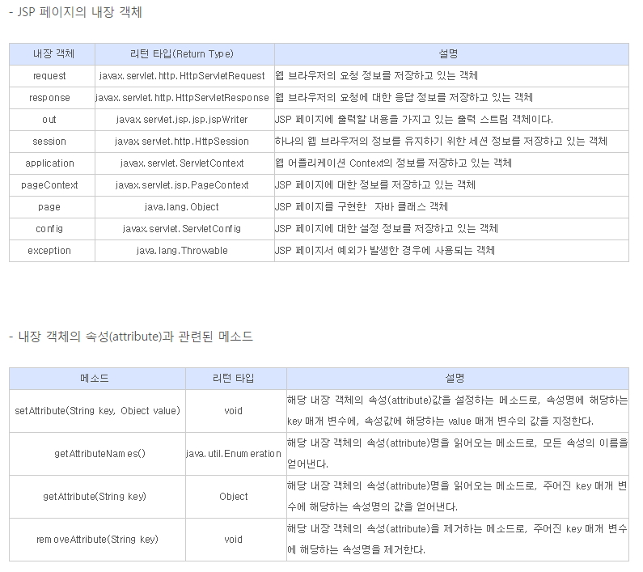

# JSP 내부객체, 서블릿 기초 문법

#### JSP 내부객체의 이해

* 개발자가 객체를 생성하지 않아도 jsp페이지가 서블릿 컨테이너(Tomcat)로 

   로딩되면 Tomcat등 서버가 자동으로 생성하는 객체이다

* 개발자는 반복적인 작업을 줄이고 필요한 작업만 할수 있다. 

*  jsp페이지는 Web서버 및 Servlet Container라고 하는 복잡한 환경에서 실행이 
 되기 때문에, 실행중에 여러가지 상태정보를 가지고 있어야 하는데, 

 이런 경우에 사용되는 객체들이 내부 객체들이다. 

* 내부 객체로 인해 개발자는 좀더 쉽게 JSP 프로그래밍이 가능함. 

####  request, response, out 

__클라이언트로 부터 jsp 페이지의 호출에 의해서 전달되는 데이터 요청과 응답,
 출력의 역할을 한다.__

 -  javax.servlet.http.HttpServletRequest Interface를 Tomcat등 서버가 구현한 객체, 
    자동화된 객체, 개발자는 사용만함. 
 - <FORM>에서 입력되어 브러우저가 전송한 데이터를 Tomcat 서버의 JSP에서 
    처리할수 있도록 객체로 가져오는 역할을 한다 
 - ? : 파라메터를 보낸다는 뜻
 - &: 접속자가 보내는 값이 2개 이상인 경우  

__실행결과__

http://localhost:8000/jsptest/request.jsp?pay=3000000&name=홍길동&java=100&jsp=90&spring=90

\1. http://localhost:8000/jsptest/request.jsp
\2. /jsptest/request.jsp
\3. 사용자로부터 입력을 받을 경우
급여: 3000000
\4. 사용자로부터 입력값이 여러개인 경우
급여: 3000000
성명: 홍길동
JAVA: 100
JSP: 90
Spring: 90
총점: 280
평균: 93