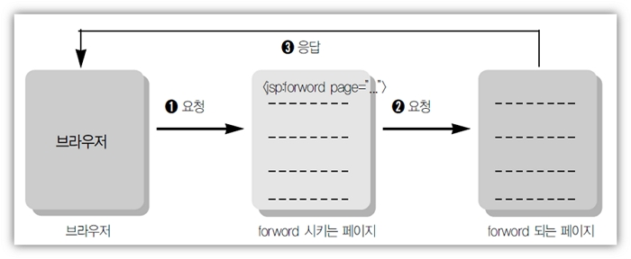

# jsp 기초문법

- -  \- WEB 환경에서 JAVA를 이용한 DBMS 접근을 처리 .

     \- Java Logic 처리를 구현

     \- JAVA를 기반으로하는 문법

     \- JSP 고유의 태그가 존재

     \- JSP의 출력 결과를 HTML과 CSS로 편집하여 출력


### 스크립틀릿의 이해

* 일반적인 java 코드가 쓰임: <% ... JAVA 코드 명시 ... %>

```
<%@ page language="java" contentType="text/html; charset=UTF-8"
    pageEncoding="UTF-8"%>
<!DOCTYPE html>
<html>
<head>
<meta charset="UTF-8">
<title>Insert title here</title>
</head>
<body>
<%
String name = "왕눈이";
int kuk = 90;
int eng = 95;
int tot = kuk + eng;
int avg = tot / 2;
%>
 
<h1>성적표</h1>
<div style='font-size: 24px;'>
  -------------------------<br>
  성명: <% out.println(name); %><br>
  국어: <% out.println(kuk); %><br>
  영어: <% out.println(eng); %><br>
  총점: <%=tot %><br> 
  평균: <%=avg %><br>
</div>
 
<%
// System.out.println(">>>>> name: " + name);
%>
</body>
</html>
```

###  지시자

* JSP 지시자
  - 지시자는 태그 안에서 @으로 시작하며, 3가지 종류가 있다.
     page, include, taglib
* page 지시자
  -  jsp페이지에서 지원되는 속성들을 정의하는 것들이다.
  - jsp페이지에서 JSP컨테이너에게 해당 페이지를 어떻게 처리할 것인가에
     대한 페이지 정보를 알려준다.

■ info : 페이지설명, jsp 페이지 제목을 붙이는 것과 같다.
■ language : Jsp페이지의 스크립트 언어지정 기본값은 Java
■ contentType: jsp의 출력 형식 지정, 문자 셋을 지정합니다. 

 \- 형식: contentType="text/html; charset=UTF-8" 

 <%@ page contentType="text/html; charset=UTF-8" %> 

 \- JSP처리 결과가 HTML임으로 MIME Type을 'text/html'과 문자 코드(UTF-8)
  선언. 

 \- MIME Type: 브러우저가 출력하는 데이터의 종류를 나타낸 코드값, 

 예) image/jpg는 이미지가 출력됨 

 \- HTML 태그의 META태그도 일치시켜야함(브러우저용). 

 <meta http-equiv="Content-Type" content="text/html; charset=UTF-8"> 

 <meta http-equiv="Content-Type" content="text/html; charset=EUC-KR"> 


■ import: 패키지의 import, 중복 사용가능 

  자바에서 패키지를 사용하겠다고 선언하는 것과 같다.

  예) <%@ page import="java.util.*" %>


* include 지시자

  - 여러 jsp페이지에서 공통적으로 포함하는 내용이 있을 때 이러한 내용을
      매번 입력하지 않고 파일에 저장한 후 JSP파일에 포함해서 실행한다.
  - 처리 결과가 합쳐지는 것이 아니라 파일의 소스가 하나의 파일에 합쳐진
      다음 실행된다. 

   list.jsp 소스 + ssi.jsp 소스 = jsp 통합 큰 소스 ==> 실행 

    \-------------------------------------------------------------  

  - 사용 방법 

   <%@ include file="Local URL" %> 

   

   <%@ include file="./ssi.jsp" %> 


* 액션태그

  - JSP 문법이다.

  - 액션태그의 종류는 include, forward, useBean, setProperty, getProperty
     등이 있다.

    * useBean, setProperty, getProperty
      \- 자바빈즈(JavaBeans)와 통신을 위해서 구현한 액션태그이다.

      * forward
        \- 다른페이지로 이동할 때 사용하는 태그이다.

        


forward 액션태그 예제(3파일)

```
>>>forwardTag1.html
<html>
<head>
<meta http-equiv="Content-Type" content="text/html; charset=UTF-8"/>
</head>
<body>
<h1>Forward Tag Example1</h1>
<form method=post action="forwardTag1_1.jsp">
아이디 : <input name="id"><p/>
패스워드 : <input type="password" name="pwd"><p/>
<input type="submit" value="보내기">
</form>
</body>
</html>
```

------------------------

``` 
>>> forwardTag1_1.jsp
<%@page contentType="text/html;charset=UTF-8"%>
<%
           request.setCharacterEncoding("UTF-8");
%>
<html>
<body>
<h1>Forward Tag Example1</h1>
Forward Tag의 포워딩 되기 전의 페이지입니다.
<jsp:forward page="forwardTag1_2.jsp" />
</body>
</html>
```

--------------------

```

>>>forwardTag1_2.jsp
<%@page contentType="text/html;charset=UTF-8"%>
<%
        String id = request.getParameter("id");
        String pwd = request.getParameter("pwd");
%>
<h1>Forward Tag Example1</h1>
당신의 아이디는<b><%=id%></b>이고<p/>
패스워드는 <b><%=pwd%></b> 입니다.
```

